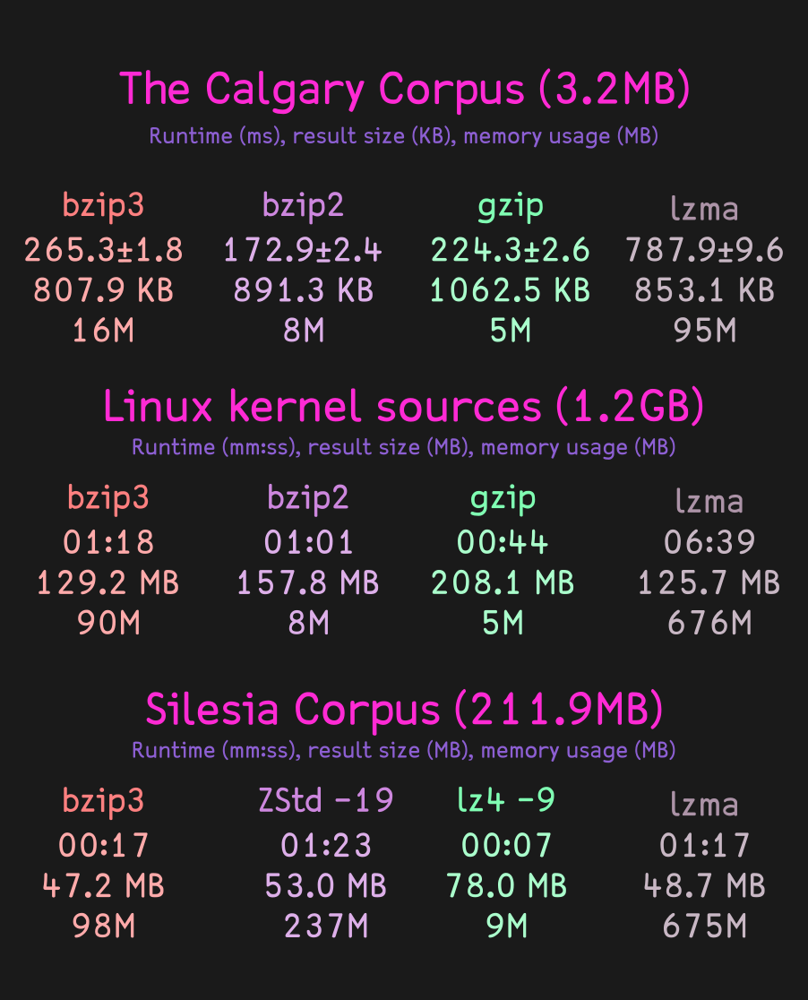

# BZip3

A better, faster and stronger spiritual successor to BZip2. Features higher compression ratios and better performance thanks to a order-0 context mixing entropy coder, a fast Burrows-Wheeler transform code making use of suffix arrays and a RLE with Lempel Ziv+Prediction pass based on LZ77-style string matching and PPM-style context modeling.

Like its ancestor, **BZip3 excels at compressing text or code**.

## Installation

```
make all && sudo make install
```

## Disclaimers

**I TAKE NO RESPONSIBILITY FOR ANY LOSS OF DATA ARISING FROM THE USE OF THIS PROGRAM/LIBRARY, HOWSOEVER CAUSED.**

Every compression of a file implies an assumption that the compressed file can be decompressed to reproduce the original. Great efforts in design, coding and testing have been made to ensure that this program works correctly.

However, the complexity of the algorithms, and, in particular, the presence of various special cases in the code which occur with very low but non-zero probability make it impossible to rule out the possibility of bugs remaining in the program.

DO NOT COMPRESS ANY DATA WITH THIS PROGRAM UNLESS YOU ARE PREPARED TO ACCEPT THE POSSIBILITY, HOWEVER SMALL, THAT THE DATA WILL NOT BE RECOVERABLE.

That is not to say this program is inherently unreliable. Indeed, I very much hope the opposite is true. Bzip3/libbz3 has been carefully constructed and extensively tested.

**Bzip3's performance is _heavily_ dependent on the compiler. x64 Linux clang13 builds usually can go as high as 17MiB/s compression and 23MiB/s decompression _per thread_. Windows and 32-bit builds might be considerably slower.**

## Benchmarks



Check etc/BENCHMARKS.md for more results.

## Thanks

- Ilya Grebnov for his `libsais` library used for BWT construction in BZip3 and the LZP encoder which I had used as a reference implementation to improve myself.
